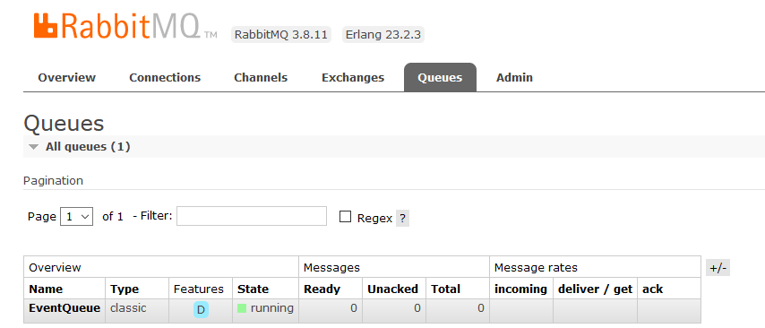
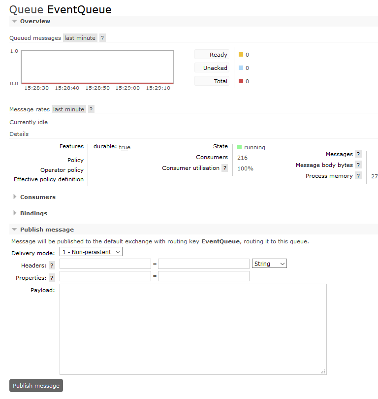
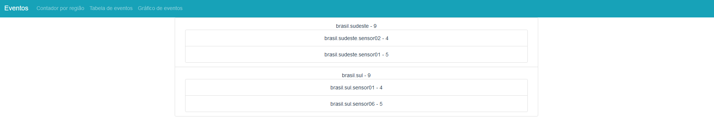
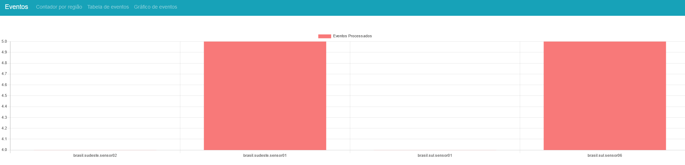
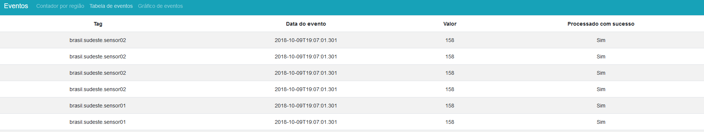

# Solução desenvolvida

Foi desenvolvida uma API em .NET 5 para o desafio Radix, que consiste em rastrear as medições de sensores para cada região no Brasil. Para isto, foi utilizado o RabbitMQ que receberá essas medições a cada input do usuário.

Para a exibição dos eventos processados foram desenvolvidos endpoints para obter as informações necessárias, e uma aplicação web utilizando a framework Vue.js.

Para consultar a documentação dos endpoints, acessar o endpoint localhost:5000/documentation.

## Instruções de uso

Execute o comando `make all` para construir e subir os containers especificados no arquivo `docker-compose.yml`. 

Acesse o painel do RabbitMQ, clique na aba "Queues" e acesse a fila EventsQueue para publicar a mensagem do evento.

Para visualizar os eventos processados pela API acesse a aplicação web.

## Acessos:

* Painel do RabbitMQ: localhost:15672;
* Aplicação web: localhost:8080;
* Postgres: localhost:15432;

## Melhorias futuras

* Melhorar a exibição do gráfico pois as colunas estão muito grandes;
* Configurar a tela do gráfico para atualizar sozinho;
* Adicionar um middleware na aplicação para capturar qualquer exceção e logar corretamente;
* Ajustar a impressão da data do evento na tabela no front;
* Corrigir bug ao tentar exibir quatro sensores no gráfico, por algum motivo quando existem 4 sensores a exibição do gráfico fica inconsistente.

## Requerimentos

* git
* docker
* make (para executar o makefile)
